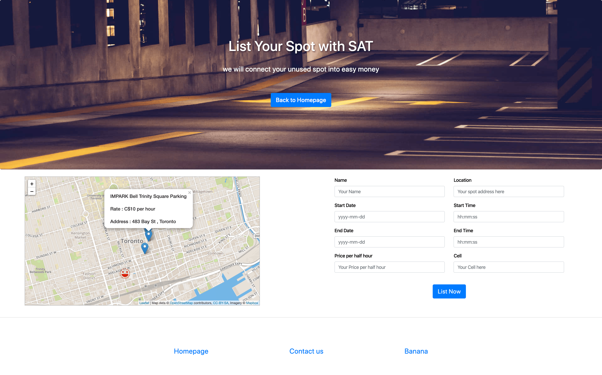

### SAT, Parking Sharing Platform in Toronto

###### About our team

Super Awesome Team was created in 2019. We are a group of very diverse individuals who have formed together in a SUPER AWESOME unity to bring you apps that will change the world as we know it. 

###### Painpoint of the market

It was a cold Saturday in downtown Toronto. Zepa was driving around the city looking for parking for school . She came across a safe secure parking lot that was affordable . 10 Dollars for 24hrs ! After class was done she realized that only 4 hours of her parking ticket have been consumed. What a waste ! At this point she turned on her phone downloaded SAT . In minutes she posted her parking ticket for $5.00 for the remaining hours . In seconds it was sold . Not only did she make some money but the remaining hours did not go to waste.

###### Goal of the SAT parking share platform

- You can buy and sell parking spots

- You are able to look for long term and short term parking

- Easy to use 

  

###### Features summaries:

- Check all the available parking spots in downtown Toronto
- Check the most recent updated parking spots
- Check available parking spot based on your location
- Sell your parking spot and list on the map
- Check your surrounding Green Parking Spots for price reference 

